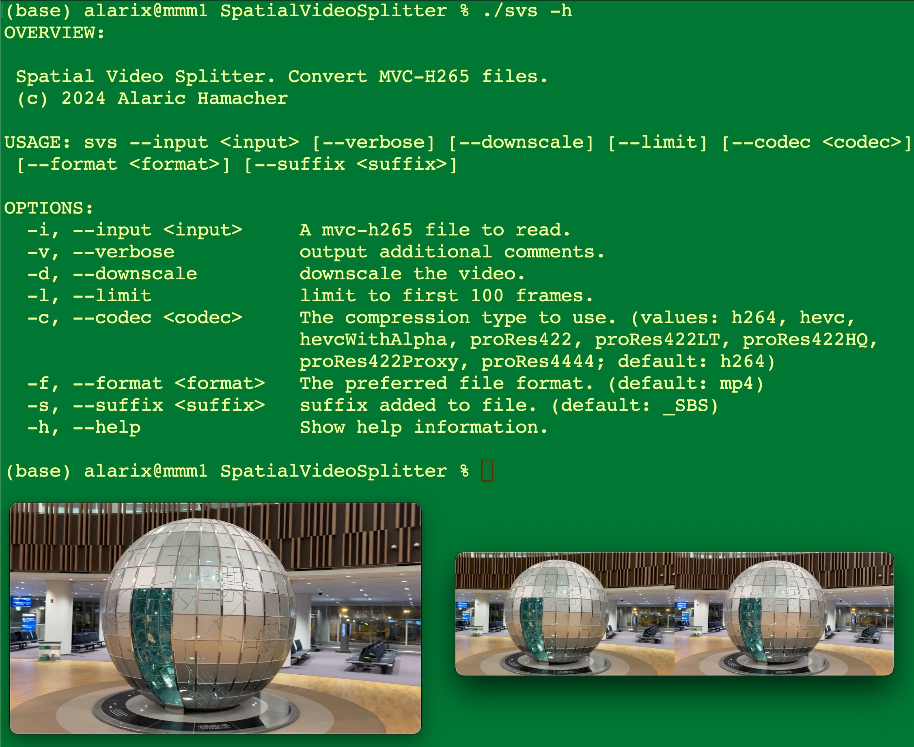

# SpatialVideoSplitter

## Description
command line tool for mac osx. splitting a spatial video file MVC-HEVC file in to side by side video files.
The tool has a couple of options that are described in the help switch.
The limit switch allows to make short tests before encoding large files.

<picture>
   
</picture>

## Installation
via homebrew

```
brew tap stereo3d/svs
brew install svs
```

## Usage

```
USAGE: svs --input <input> [--verbose] [--downscale] [--limit] [--codec <codec>] [--format <format>] [--suffix <suffix>]

OPTIONS:
  -i, --input <input>     A mvc-h265 file to read.
  -v, --verbose           output additional comments.
  -d, --downscale         downscale the video.
  -l, --limit             limit to first 100 frames.
  -c, --codec <codec>     The compression type to use. (values: h264, hevc,
                          hevcWithAlpha, proRes422, proRes422LT, proRes422HQ,
                          proRes422Proxy, proRes4444; default: h264)
  -f, --format <format>   The preferred file format. (default: mp4)
  -s, --suffix <suffix>   suffix added to file. (default: _SBS)
  -h, --help              Show help information.
```

## Disclaimer

The tool is in early stage. It does not process the sound. 
There is no warranty this is working perfectly. Please use it at your own risk.

## Acknowledgement
Thank you for xaphod/VideoWriter.swift
https://gist.github.com/xaphod/de83379cc982108a5b38115957a247f9
for showing the way of doing this.
